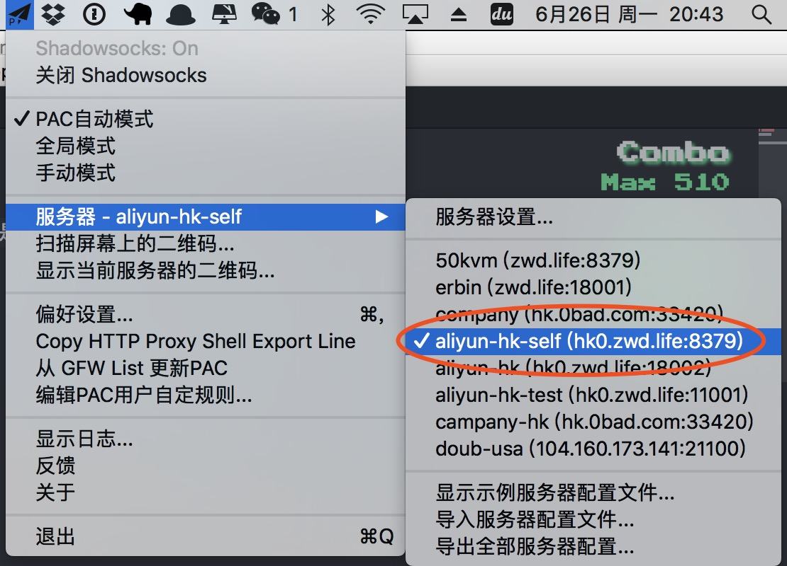
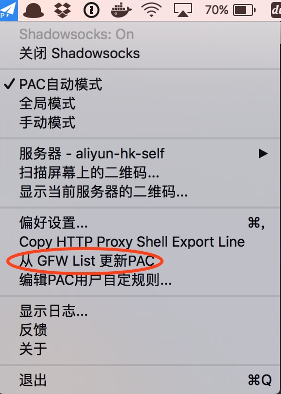
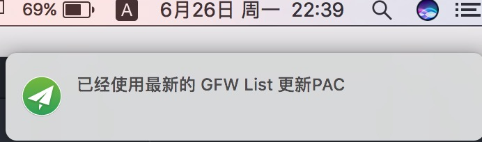
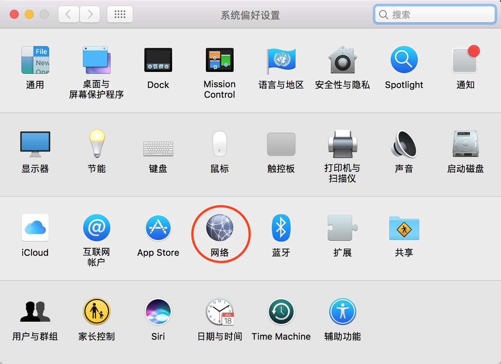
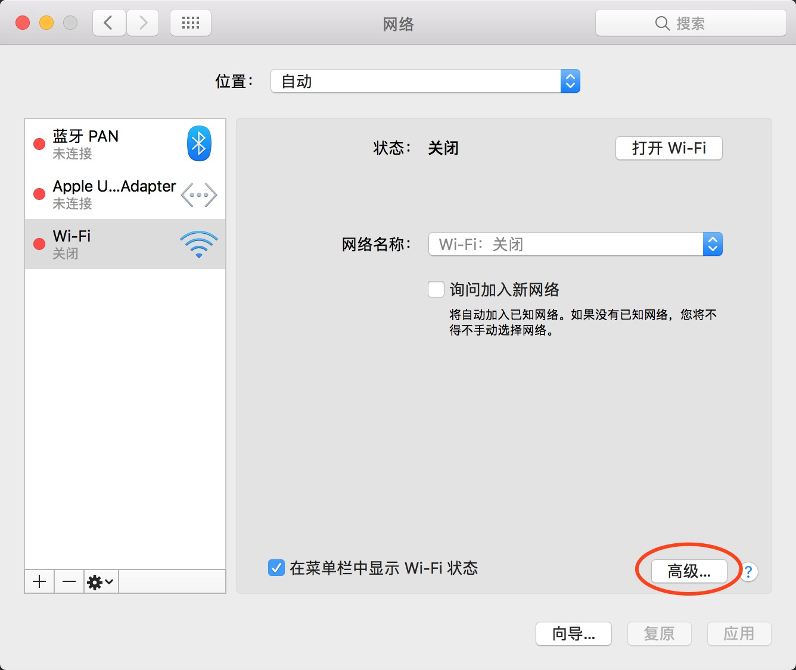
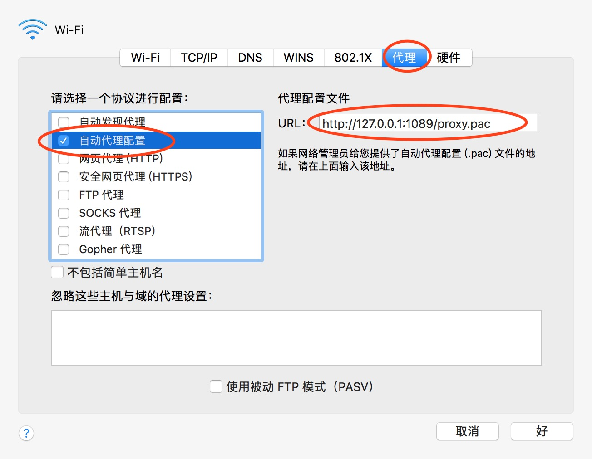

# Tomato-QA
关于番茄的疑难杂症

## 检查shadowsocks-ng的设置

  

首先打开`shadowsocks-ng`，查看服务器设置那块是否已经打勾

  

接着选中菜单项`从GFW List更新PAC`

出现该提示则说明可以正常加载需要番茄的网址

## 检查系统网络设置

打开`系统偏好设置`，找到`网络`，定位到上图的`代理配置文件`URL，复制下来通过浏览器打开`URL`，如果这时是开始下载`proxy.pac`的文件的话，并且是下载完成的话，说明番茄服务已经起来了才对。
